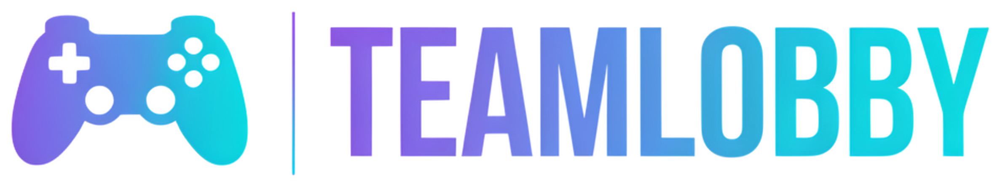

<div align="center">

  

  <br/><br/>

  [](https://team-lobby.vercel.app/)
  [-10b981?style=for-the-badge&logo=gamepad&logoColor=white)](https://team-lobby.vercel.app/)
  [](https://team-lobby.vercel.app/)
  [](https://team-lobby.vercel.app/)

  <p align="center">
    <strong>Soluciones digitales para la gestión de equipos, toma de decisiones y sistemas de juego.</strong><br/>
    Un producto del portafolio tecnológico de <strong>Idoneus Software</strong>.
  </p>

  <p align="center">
    <a href="#-acerca-de-teamlobby">Acerca de</a> •
    <a href="#-características-principales">Características</a> •
    <a href="#-galería-gamer-personal">Galería Gamer</a> •
    <a href="#-amigos-y-retos">Amigos y Retos</a> •
    <a href="#-toma-de-decisiones-y-ruleta">Decisiones y Ruleta</a> •
    <a href="#-legal-privacidad-y-licencia">Legal y Privacidad</a>
  </p>

</div>

---

## 🎮 Acerca de TeamLobby

**TeamLobby** nace para resolver de forma definitiva el dilema más común de toda comunidad de jugadores: **«¿A qué jugamos hoy?»**. 

A diferencia de las herramientas de chat convencionales, TeamLobby es un **centro de mando interactivo en tiempo real** diseñado para reunir a tu escuadra, proponer títulos sincronizados con el catálogo oficial de Steam, debatir mediante votación democrática o ruletas de azar, y ofrecer un espacio personal y social donde inmortalizar los juegos que has superado, tus trofeos platinados y los retos pendientes entre amigos.

> [!TIP]
> **Acceso instantáneo**: TeamLobby permite crear y unirse a salas tanto con cuenta de Google como en **Modo Invitado**, permitiendo que cualquier jugador participe al vuelo sin barreras de entrada.

---

## ⚡ Características Principales

### 🕹️ Salas en Tiempo Real (Lobbies)
* **Salas Públicas y Hub Comunitario**: Espacios globales donde cualquiera puede ingresar, compartir propuestas y jugar con la comunidad.
* **Salas Privadas con Contraseña**: Lobbies protegidos con clave de acceso exclusiva para tu grupo de amigos o clan competitivo.
* **Presencia en Vivo**: Sincronización instantánea de jugadores conectados, líderes de escuadra y estado de preparación.

---

### 🎲 Toma de Decisiones Democrática y Ruleta del Destino
* **Búsqueda Inteligente con Steam**: Autocompletado oficial que consulta la base de datos de Steam para rellenar automáticamente títulos, géneros, enlaces oficiales a la tienda y carátulas en alta definición.
* **Votación de Propuestas**: Cada integrante puede votar por sus títulos preferidos en la cola de la sala.
* **Comando Ready**: Mecanismo de sincronización donde los miembros marcan *«ESTOY LISTO»*. Una vez todo el equipo está preparado, el líder puede procesar la votación.
* **Ruleta del Destino**: ¿Empate técnico o indecisión total? Haz girar la ruleta animada con efectos físicos y de sonido para que el destino elija el juego de la noche.

---

### 🔊 Soundboard Gamer y Comunicaciones
* **Efectos de Audio Inmersivos**: Sonidos retro-futuristas al votar, unirse a una sala, confirmar el comando Ready o girar la ruleta.
* **Control Maestro de Sonido**: Botón de mute global con persistencia en el navegador para jugar con total comodidad.
* **Chat de Escuadrón P2P**: Canal de mensajería instantánea integrado para coordinar estrategias directamente dentro de la sala.

---

## 🏆 Galería Gamer Personal (Backlog & Vitrina)

Un espacio personal y público donde cada jugador puede registrar su biblioteca, valoraciones y hazañas:

```
                  ┌─────────────────────────────────────────┐
                  │           GALERÍA GAMER PERSONAL        │
                  ├─────────────────────────────────────────┤
                  │  🎮 Terminado         🏆 100% Platino   │
                  │  🕹️ Jugando           ⏳ Por Jugar      │
                  │  ⏸️ En Pausa          🛑 Dropeado       │
                  └─────────────────────────────────────────┘
```

* **Estados de Progreso**: Clasificación al estilo *Backloggd* o *MyAnimeList* (*Terminado*, *100% Platinado*, *Jugando*, *Por Jugar*, *En Pausa*, *Dropeado*).
* **Trofeos y Condecoraciones Especiales**:
  * 🏆 **Platino**: Completado al 100% de logros.
  * 💀 **Dificultad Pesadilla**: Superado en la máxima dificultad o modo permadeath.
  * ⚡ **Speedrun**: Superado contrarreloj o récord de velocidad.
  * 🛡️ **Sin Daño (No-Hit)**: Victoria limpia sin recibir golpes.
  * 🤝 **Victoria Cooperativa**: Completado en equipo.
* **Notas del Jugador e Impresiones**: Espacio para registrar tus sensaciones, builds recomendadas, momentos memorables o advertencias a otros jugadores.
* **Comentarios Comunitarios**: Recibe felicitaciones, opiniones y debates de amigos en cada una de tus entradas.
* **Niveles de Privacidad Granular**: Escoge si tu galería es **Pública**, visible **Sólo para Amigos** o estrictamente **Privada**.

---

## ⚔️ Amigos de Escuadra y Retos Gamer

TeamLobby fomenta la sana rivalidad y el juego conjunto mediante un sistema social ligero y directo:

* **Códigos de Jugador Únicos (`#TL-XXXX`)**: Identificador permanente derivado de tu cuenta para compartir y agregar amigos sin compartir datos sensibles.
* **Sistema de Amistad**: Envío, aceptación y gestión de solicitudes de amistad entre miembros.
* **Retos Gamer**: Lanza desafíos personalizados a tus amigos (ej. *«Derrota a Malenia sin invocar»* o *«Completa la campaña en dificultad Pesadilla»*) con seguimiento de estado (*Pendiente*, *Aceptado*, *Completado*).

---

## 🌐 Internacionalización Completa (ES / EN)

La plataforma cuenta con un motor de internacionalización nativo (`i18n`) con soporte total para:
* **Español 🇪🇸 / 🇨🇴**
* **Inglés 🇺🇸**

El sistema detecta automáticamente el idioma de tu navegador y permite alternar en cualquier momento con guardado instantáneo en tus preferencias locales.

---

## 🛠️ Stack Tecnológico

| Componente | Tecnología |
|---|---|
| **Frontend Core** | [React 18](https://react.dev/) + [TypeScript](https://www.typescriptlang.org/) |
| **Tooling & Build** | [Vite](https://vitejs.dev/) |
| **Estilos & UI** | [Tailwind CSS](https://tailwindcss.com/) (Dark Cyberpunk Theme) |
| **Iconografía** | [Lucide React](https://lucide.dev/) |
| **Base de Datos & Auth** | [Google Firebase](https://firebase.google.com/) (Realtime Database & Google OAuth) |
| **Catálogo de Juegos** | [Steam Store Web API](https://store.steampowered.com/) |
| **Audio FX** | Web Audio API / Sound Engine Nativo |

---

## 📜 Legal, Privacidad y Licencia

* **Aviso de Propiedad Intelectual**:
  ```text
  © 2026 Idoneus Software. Todos los derechos reservados.
  ```
* **Responsabilidad Jurídica**:
  En cumplimiento de la legislación colombiana de protección de datos personales (**Ley Estatutaria 1581 de 2012** y Decreto 1377 de 2013), la gestión, almacenamiento y tratamiento de información para **TeamLobby** y **DnD Companion** están bajo la responsabilidad directa y personal de **Julian Andrés Osorio Marín**, domiciliado en **Colombia**.
* **Canal Oficial y Derechos ARCO**:
  Para ejercer derechos de Acceso, Rectificación, Cancelación y Oposición de datos, o para soporte técnico y consultas comerciales:
  📬 **`jaomp3@gmail.com`**
* **Atribución de Marcas**:
  Las marcas comerciales, logotipos, portadas y nombres de videojuegos mostrados pertenecen a sus respectivos desarrolladores y a **Valve Corporation** (Steam).

---

<div align="center">
  <sub>Desarrollado con dedicación gamer por <strong>Julian Andrés Osorio Marín</strong> bajo el sello <strong>Idoneus Software</strong>.</sub><br/>
  <sub>🇨🇴 Hecho en Colombia • 2026</sub>
</div>
